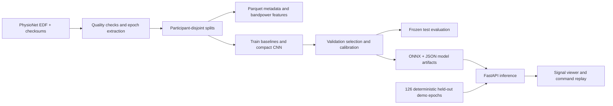

# IntentLab

**Decode imagined movement from recorded brain signals.**

IntentLab is an interactive motor-imagery EEG experiment. Participants imagined moving their left or right fist; the app runs a trained model on their recorded brain signals, displays its confidence, and replays a cursor command only when the confidence threshold is met.

[Open the experiment](https://intentlab-bci.vercel.app) · [Live API](https://intentlab-bci.vercel.app/docs) · [Learn the project](docs/WALKTHROUGH.md) · [Edit the website text](docs/EDITING.md)

[](https://github.com/shrut10/intentlab-bci/actions/workflows/ci.yml)

## What you can do

- Explore 126 real EEG epochs from 21 people excluded from training and model selection.
- Compare a compact neural network with signal-processing baselines through actual server-side inference.
- Change the confidence threshold, add repeatable noise or disconnect an electrode.
- Inspect channel-occlusion explanations, frequency spectra, calibration and errors.
- Replay a six-trial sequence and see the trade-off between making a command and waiting.
- Trace every sample back to its public recording and reproduce the data pipeline and training.

This is a **recorded-data research demo**, not a live headset, medical device or thought reader. It classifies experimental imagery labels. It does not decode dreams or measure consciousness.

## Actual results

All 327 selected recordings were verified against PhysioNet's published SHA-256 checksums. Prespecified quality checks retained **4,766 trials from 106 people**, split into 63 training, 22 validation and 21 test participants. There is no overlap of people between splits.

| Model | Validation balanced accuracy¹ | Test balanced accuracy¹ |
|---|---:|---:|
| Constant training-majority baseline | 50.0% | 50.0% |
| Log-bandpower + logistic regression | 54.1% | 58.7% |
| CSP + shrinkage LDA | 55.2% | 61.5% |
| Compact EEG CNN — selected on validation | **57.1%** | **61.1%** |

¹ Mean of each participant's balanced accuracy. CNN 95% participant-bootstrap interval: **55.8–66.6%**. These results are for this particular task and split, not comparable with within-person results or different movement classes.

The CNN was selected using validation performance, even though CSP scored slightly higher on the final test. Its architecture has **1,289 parameters** and its ONNX artifact is about **8 KB**.

**The reliability target was not met.** No validation threshold achieved 75% retained-trial accuracy while retaining at least 20% of trials and at least 100 examples. The declared fallback confidence threshold of 0.75 accepted only **27/945 test trials (2.9%)**, of which 24 were correct. That 88.9% figure is based on very few selected trials and is **not overall accuracy or evidence of reliable device control**. Most default replay steps intentionally stay still. Lowering the UI threshold is an exploratory experiment.

Removing C3 or C4 reduced test participant-macro balanced accuracy to **52.8%** and **52.9%** respectively. Channel sensitivity is consistent with the chosen sensorimotor montage, but does not establish a causal neural mechanism.

[Full metrics](artifacts/evaluation.json) · [Model card](docs/MODEL_CARD.md) · [Protocol recorded before training](docs/PROTOCOL.md) · [Data card](docs/DATA_CARD.md)

## Calibration and alignment follow-up

The [follow-up to issue #1](https://intentlab-bci.vercel.app/research/adaptation) compares a matched baseline, ten-trial personal temperature scaling, Euclidean alignment, and their combination across three training seeds. Evaluation uses later runs from the same 21 test participants, with all conditions, uncertainty and command coverage reported. This is an exploratory comparison on an already inspected benchmark; the original deployed model and the results above are unchanged.

[Study protocol and reproduction guide](experiments/adaptation-v1/README.md) · [Archived results](artifacts/adaptation-v1/evaluation.json) · [Prediction data](artifacts/adaptation-v1/predictions.parquet)

## Architecture



**Training:** Python, MNE, NumPy, SciPy, scikit-learn, PyTorch, Parquet.

**Serving:** FastAPI, ONNX Runtime, NumPy/SciPy, plain HTML/CSS/JavaScript, Vercel.

**Engineering:** Docker with non-root user, GitHub Actions, automated data/model/API tests, checksum checks at startup, strict input schemas and bounded requests. No paid model API, account or API key is required to use the demo.

## Run locally

Python 3.12 is the tested version. Run from the repository root:

```sh
python3 -m venv .venv
source .venv/bin/activate
pip install -r requirements-dev.txt
python -m uvicorn app:app --reload
```

Open `http://127.0.0.1:8000`. Published artifacts are bundled; you do not need to download raw data or train a model to run the app.

```sh
pytest -q
ruff check .
ruff format --check .
node --check web/app.js
python scripts/smoke_test.py
```

Or use Docker:

```sh
docker build -t intentlab-bci .
docker run --rm -p 8000:8000 intentlab-bci
```

## Reproduce the experiment

Read the [protocol](docs/PROTOCOL.md) first. Downloads total approximately 796 MiB; processed training epochs require approximately 90 MiB. Training ran on a CPU. Package dependencies require additional disk space.

```sh
pip install -r requirements-training.txt
python scripts/prepare_data.py
python scripts/train.py --overwrite
```

`--overwrite` is explicit because a frozen evaluation is already included. Use it to reproduce the same experiment, not to tune against its test set. Subsequent acquisition can use `python scripts/prepare_data.py --offline`. Source hashes, quality exclusions and split IDs are in [manifest.json](data/derived/manifest.json). CPU/backend differences may slightly change floating-point outputs; this is one training seed, not a multi-seed benchmark.

## API example

```sh
curl https://intentlab-bci.vercel.app/api/predict \
  -H 'Content-Type: application/json' \
  -d '{"trial_id":"S010-R04-E01","threshold":0.75,"noise":0.0}'
```

| Endpoint | Purpose |
|---|---|
| `GET /health` | Model readiness, version and artifact integrity |
| `GET /api/overview` | Cohort, channels, model selection and headline results |
| `GET /api/trials` | Available recordings and source metadata |
| `GET /api/trials/{id}` | Display signal and recorded cue |
| `GET /api/trials/{id}/csv` | All 480 normalised samples for a demo epoch |
| `POST /api/predict` | Live model inference, abstention, spectrum and occlusion |
| `GET /api/evaluation` | Frozen validation/test results and robustness analysis |
| `GET /docs` | Interactive API specification |

The public API accepts only bundled trial IDs and bounded perturbations. It does not accept private EEG uploads. The recorded label is returned for comparison **after** inference and is not a model input.

## Read and modify

| File | Start here for |
|---|---|
| [web/index.html](web/index.html) | Homepage wording, headings, explanations and field notes |
| [web/app.js](web/app.js) | Dynamic messages, controls and charts |
| [web/styles.css](web/styles.css), [web/base.css](web/base.css) | Appearance, colours and responsive layout |
| [src/intentlab/signal.py](src/intentlab/signal.py) | Shared signal transforms |
| [scripts/train.py](scripts/train.py) | Models, calibration and evaluation |
| [src/intentlab/inference.py](src/intentlab/inference.py) | Production inference without PyTorch |
| [src/intentlab/api.py](src/intentlab/api.py) | API routes and request validation |

See [Editing](docs/EDITING.md), [Walkthrough](docs/WALKTHROUGH.md) and [Operations](docs/OPERATIONS.md) for practical instructions.

## Sources and licences

Data: Schalk, G. (2009). *EEG Motor Movement/Imagery Dataset*, v1.0.0. PhysioNet. [doi:10.13026/C28G6P](https://doi.org/10.13026/C28G6P). Data and database derivatives are attributed under **ODC-BY 1.0**. See [NOTICE.md](NOTICE.md) for the required citations and data licence.

The compact CNN is **inspired by EEGNet**, not an exact reproduction: Lawhern et al. (2018), *EEGNet: A Compact Convolutional Network for EEG-based Brain-Computer Interfaces*. [Paper](https://arxiv.org/abs/1611.08024).

Original application code is MIT licensed. The MIT licence does not replace the dataset's licence. Built by Shruthi with AI coding assistance; the recorded experiments and source provenance are inspectable.

## Research report

The [on-site research report](https://intentlab-bci.vercel.app/research) describes the methods, compares every fixed candidate, and critically assesses generalisation, calibration, abstention and signal perturbations, with eight academic/data references and a downloadable BibTeX bibliography. It is an independent project report rather than a peer-reviewed publication. Source: `web/research.html`; editing guide: [docs/EDITING.md](docs/EDITING.md). Automated checks verify the published comparison table against the archived results.
